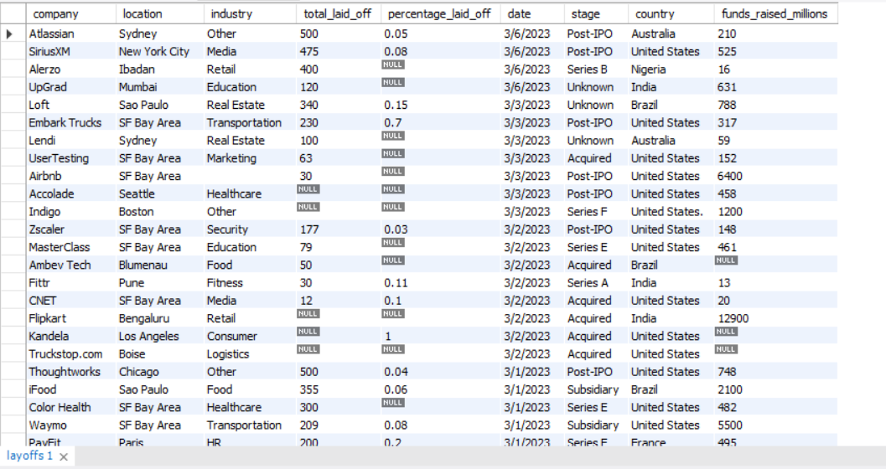
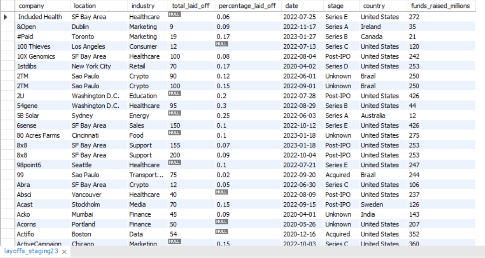

# Global Layoffs Data Analysis Pipeline | MySQL

## 📌 Overview

This project is an end-to-end SQL data analysis project based on a real-world global layoffs dataset.

The project covers the complete data workflow:

Raw Data → Data Cleaning → Data Standardization → Exploratory Data Analysis → Insights

The goal is to transform raw and inconsistent data into a clean dataset and extract meaningful business insights using MySQL.

---

# 📂 Dataset

Dataset Source:

Kaggle - Global Layoffs Dataset

The dataset contains information about:

- Company
- Location
- Industry
- Total employees laid off
- Percentage laid off
- Date
- Company stage
- Country
- Funds raised

---

# 🛠 Technology Used

- MySQL
- SQL
- MySQL Workbench

---

# 🚀 Project Workflow

## 1. Data Cleaning

Performed data preprocessing:

- Removed duplicate records
- Created staging tables
- Handled NULL values
- Standardized inconsistent values
- Cleaned date format
- Removed unnecessary data

## 2. Exploratory Data Analysis (EDA)

Performed analysis to find:

- Companies with highest layoffs
- Industries most affected
- Countries with maximum layoffs
- Year-wise layoffs trend
- Percentage layoffs analysis
- Company stage impact

---

# 📁 Project Structure
Global-Layoffs-SQL-Analysis/

│
├── Dataset/
│ └── layoffs.csv
│
├── SQL/
│ ├── 01_Data_Cleaning.sql
│ └── 02_Exploratory_Data_Analysis.sql
│
├── Screenshots/
│ ├── raw_dataset.png
│ ├── cleaned_dataset.png
│ └── analysis_output.png
│
└── Insights.md

---

# 📸 Screenshots

## Raw Dataset

## Cleaned Dataset

## Analysis Output

---

# 📊 SQL Concepts Used

- SELECT
- WHERE
- GROUP BY
- ORDER BY
- Aggregate Functions
- UPDATE
- DELETE
- ALTER TABLE
- CASE Statements
- Common Table Expressions (CTE)
- Window Functions
- ROW_NUMBER()

---

# 💡 Key Learning

Through this project I practiced:

- Real-world data cleaning techniques
- Handling messy datasets
- Writing optimized SQL queries
- Performing exploratory analysis
- Extracting business insights

---

# 👨‍💻 Author

**Vedant Shinde**

GitHub:
(https://github.com/vedantt3028)

LinkedIn:
( linkedin.com/in/vedant-shinde3030 )
